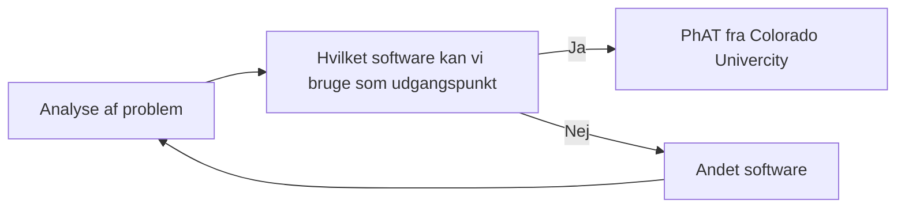

# Elektronik-Opgave
! Følgende projekt er under udvikling.

Der er stillet en opgave fra elektronikfagtekniker faglærerne.

Projektet er ved at blive anlagt, men her er foreløbig beskrivelse af software:
* Målgruppen er folkeskole elever, som skal have et værktøj til at løse en elektronik opgave
* Opgaven består af at få 4 lysdioder til at lyse på den mest energirigtige måde
* Løsningen skal helst være en grafisk løsning
* Software skal kunne levere fornuft og og relevant information til eleven
* ... så eleven kan bruge information i sin (skriftlige?) opgaveløsning

# Inspiration og kilder
Univercity of Colorado Boulder har en side med mange simuleringer lavet i HTML5, Java og Flash.
Der er specifikt to simuleringer som er interessante:
* https://phet.colorado.edu/en/simulation/circuit-construction-kit-dc
* https://phet.colorado.edu/en/simulation/circuit-construction-kit-dc-virtual-lab

Selve simulerings siden kan findes på:
* https://phet.colorado.edu/en/simulations/filter?type=html

# Hosting på skolepraktikkens server
Det skal hostes på Skolepraktikkens server. Enten lokalt eller der vælges at hoste siden på SKPs officielle webside.

Dette er en test på at lave diagrammer
